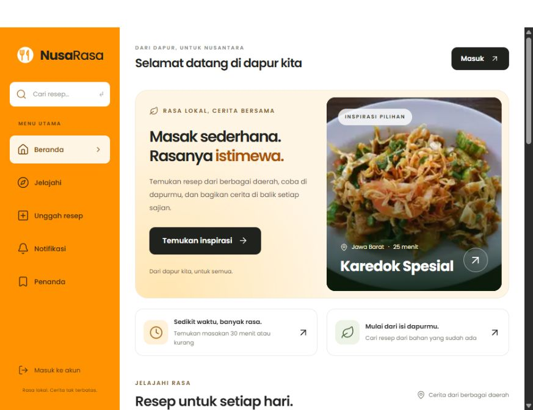

# Nusa Rasa

Aplikasi berbagi resep Nusantara oleh **Tim Nusa Rasa**. Dari menemukan menu rumahan hingga membagikan kreasi sendiri, Nusa Rasa menghubungkan pencinta masakan Indonesia dalam satu dapur digital.

[Lihat desain Figma](https://www.figma.com/design/L2yJLqEXoqZ5mpSdUfSZTI/Nusa-Rasa-Project?node-id=300-442)

## Pratinjau aplikasi



Tangkapan layar aplikasi **Tim Nusa Rasa** yang dijalankan secara lokal, menampilkan inspirasi resep pilihan serta pintasan mencari masakan berdasarkan waktu dan bahan yang tersedia. Klik gambar untuk melihat ukuran penuh.

## Tampilan dan fitur

Sidebar oranye, kartu foto makanan, dan tipografi Poppins mengikuti arah desain Figma. Navigasi menyesuaikan layar desktop dan HP.

| Halaman            | Yang bisa dilakukan                                                                                                                                     |
| ------------------ | ------------------------------------------------------------------------------------------------------------------------------------------------------- |
| Beranda & Jelajahi | Inspirasi pilihan, mencari judul/bahan, menyaring daerah dan durasi, mengurutkan resep terbaru atau paling disukai                                      |
| Detail resep       | Mode memasak dengan timer, video, bahan dan langkah, suka/penanda, berbagi tautan, komentar, serta ulasan bintang dan foto                              |
| Unggah resep       | Mengunggah foto sampul dan video opsional, mengisi informasi, bahan, dan cara membuat dalam dua langkah; video dapat diganti atau dilepas saat mengedit |
| Dapur Saya         | Melihat resep sendiri serta mengedit profil dan foto                                                                                                    |
| Penanda            | Mengumpulkan resep favorit per akun                                                                                                                     |
| Notifikasi         | Melihat pemberitahuan suka, komentar, dan ulasan baru dari pengguna lain                                                                                |
| Akun               | Daftar, masuk, keluar, dan pemulihan kata sandi melalui SMTP bila dikonfigurasi                                                                         |

Enam resep contoh tersedia untuk mencoba aplikasi. Akun editorial **Dapur Nusa Rasa** tidak memiliki kata sandi dan tidak dapat digunakan untuk masuk. Buat akun sendiri melalui **Daftar**.

### Menemukan dan mencoba resep

- **Beranda:** inspirasi pilihan, tautan resep maksimal 30 menit, serta kartu dengan jumlah bahan, porsi, durasi, video, dan rating yang berasal dari ulasan pengguna.
- **Cari bahan:** isi bahan dengan pemisah koma (maksimal 6), misalnya `kacang, mentimun`. Semua bahan tersebut harus ditemukan dalam daftar bahan resep; pencarian ini bukan pengecekan bahwa seluruh kebutuhan resep sudah tersedia. Filter dapat digabung dengan nama resep, daerah, dan durasi.
- **Mode memasak:** buka detail resep lalu pilih **Mulai mode memasak**. Ikuti satu langkah per layar, tandai selesai, lihat bahan, dan gunakan timer 1–180 menit yang dapat dijeda atau diatur ulang. Timer tetap berjalan saat berpindah langkah, tetapi berhenti saat mode ditutup, memasak selesai, atau halaman dimuat ulang. Pemberitahuan waktu habis tampil di layar tanpa bunyi atau notifikasi sistem.
- **Ulasan dan hasil masakan:** pengguna yang masuk dapat memberi 1–5 bintang, cerita, dan foto opsional (maksimal 5 MB). Setiap akun memiliki satu ulasan per resep yang dapat diperbarui atau dihapus. Penulis resep tidak menilai resepnya sendiri. Komentar tetap tersedia untuk pertanyaan dan diskusi.

Saat memperbarui versi ini, jalankan `npm run db:setup` sebelum memulai aplikasi. Tabel `reviews` ditambahkan tanpa mengubah komentar, akun, atau resep sebelumnya.

## Teknologi

- **Frontend:** React, React Router, Vite, CSS responsif, Lucide, Poppins.
- **Backend:** Node.js dan Express.
- **Database:** MySQL / MariaDB melalui `mysql2`, cocok dengan layanan **MySQL di XAMPP**.
- **Foto:** Multer dan Sharp; berkas disimpan di folder `uploads/`.
- **Video:** Multer dan Mediabunny untuk memeriksa format, pemutar HTML5 dengan kontrol; berkas disimpan di `uploads/`.
- **Email:** Nodemailer untuk tautan pemulihan kata sandi.

XAMPP menyediakan database. Aplikasi dijalankan dengan Node.js, sehingga folder proyek tidak perlu dipindah ke `htdocs`. Apache diperlukan hanya jika ingin membuka phpMyAdmin.

## Jalankan dengan XAMPP

Kebutuhan: **Node.js 24**, npm, dan XAMPP dengan MySQL/MariaDB aktif. Pengujian lokal menggunakan MariaDB 10.4.32 dari XAMPP.

1. Buka XAMPP Control Panel, lalu nyalakan **MySQL**.
2. Buka terminal di folder proyek dan pasang dependensi:

   ```sh
   npm ci
   ```

3. Salin `.env.example` menjadi `.env`. Di PowerShell:

   ```powershell
   Copy-Item .env.example .env
   ```

4. Sesuaikan koneksi di `.env`:

   ```dotenv
   DB_HOST=127.0.0.1
   DB_PORT=3306
   DB_NAME=nusa_rasa
   DB_USER=root
   DB_PASSWORD=
   PORT=4180
   HOST=127.0.0.1
   APP_ORIGIN=http://127.0.0.1:4180
   ```

   Nilai tersebut mengikuti instalasi XAMPP lokal standar. Jika MySQL kamu menggunakan kata sandi atau port lain, sesuaikan nilainya. `.env` tidak masuk Git.

5. Buat database, tabel, dan resep contoh, lalu jalankan aplikasi:

   ```sh
   npm run db:setup
   npm run dev
   ```

6. Buka **http://127.0.0.1:4180/** dan daftar akun baru.

Gunakan alamat yang sama dengan `APP_ORIGIN`. Jika mengganti host atau port, ubah keduanya. Server memeriksa asal formulir untuk melindungi sesi pengguna.

`db:setup` membuat database bila belum ada, membuat tabel dan menjalankan migrasi berversi, serta mengisi contoh hanya ketika tabel pengguna kosong. Perintah ini tidak menghapus resep atau akun yang sudah ada. Migrasi tercatat dalam tabel `schema_migrations` dan aman dijalankan kembali.

### Memperbarui instalasi yang sudah ada

Cadangkan database dan folder `uploads/`, hentikan server aplikasi, lalu jalankan setelah mengambil kode terbaru:

```sh
npm ci
npm run db:setup
npm run dev
```

Migrasi video menambahkan kolom `recipes.video` dan `uploads.kind`. Resep lama tetap menggunakan foto sampul tanpa video. Untuk mode produksi, jalankan `npm run build` lalu `npm start` sebagai pengganti `npm run dev`.

### Mengunggah video resep

1. Masuk, lalu buka **Unggah Resep** atau edit resep milikmu.
2. Isi foto sampul dan informasi resep. Pada bagian **Video cara memasak**, pilih video opsional.
3. Tunggu progres unggahan dan pemeriksaan selesai. Unggahan dapat dibatalkan; video yang sudah terpasang dapat diganti atau dihapus dari resep.
4. Lengkapi bahan dan langkah, lalu simpan. Video muncul di detail resep dengan kontrol putar, suara, dan layar penuh, tanpa autoplay.

Ukuran maksimal **50 MB**. Gunakan **MP4 H.264** (suara AAC/MP3) atau **WebM VP8/VP9** (suara Opus/Vorbis). Berkas diperiksa dari isinya, bukan hanya nama atau tipe yang dikirim browser. Video tidak dikompres atau dikonversi oleh server; ekspor video ke format tersebut sebelum mengunggah bila format aslinya berbeda. FFmpeg tidak diperlukan untuk menjalankan aplikasi.

Tombol **Hapus dari resep** melepaskan video setelah perubahan disimpan. Berkas unggahan tetap ada di penyimpanan; pembersihan berkas yang tidak digunakan belum dijalankan otomatis.

### Melihat database di phpMyAdmin

Nyalakan **Apache** di XAMPP, buka **http://localhost/phpmyadmin/**, lalu pilih database **nusa_rasa**. Tabel pengguna, resep, komentar, penanda, dan lainnya bisa dilihat di sana.

Alternatif penyiapan manual: buat database `nusa_rasa` dengan collation `utf8mb4_unicode_ci`, pilih database tersebut, lalu impor [`database/schema.sql`](database/schema.sql). Jalankan `npm run db:setup` setelahnya bila ingin menambahkan resep contoh.

### Pemulihan kata sandi

Isi `SMTP_HOST`, `SMTP_PORT`, `SMTP_USER`, `SMTP_PASS`, serta `MAIL_FROM` di `.env`, kemudian mulai ulang server. Gunakan akun SMTP yang kamu miliki. Jangan masukkan kredensial ke GitHub.

Tanpa SMTP, pendaftaran dan login tetap berfungsi; halaman pemulihan menjelaskan bahwa pengiriman email belum tersedia. Tautan pemulihan berlaku 30 menit, hanya bisa dipakai satu kali, dan membatalkan sesi lama setelah kata sandi diubah.

## Perintah

| Perintah           | Fungsi                                                    |
| ------------------ | --------------------------------------------------------- |
| `npm run db:setup` | Membuat tabel, menjalankan migrasi, dan mengisi data awal |
| `npm run dev`      | Server aplikasi dan frontend dengan pembaruan otomatis    |
| `npm test`         | Pengujian integrasi terhadap MySQL yang aktif             |
| `npm run build`    | Menghasilkan frontend siap distribusi di `dist/`          |
| `npm start`        | Menjalankan backend dan hasil build frontend              |

Tes menggunakan database sementara bernama `nusa_rasa_test_<acak>`, lalu membersihkannya. Pengguna database untuk tes harus memiliki izin membuat dan menghapus database sementara. Tes tidak mengosongkan database aplikasi.

## Struktur

```text
database/schema.sql  Struktur database untuk MySQL dan phpMyAdmin
server/              API, autentikasi, migrasi, pemeriksaan video, dan seed
src/                 Halaman serta komponen React
public/assets/       Foto resep contoh dari desain Figma
tests/               Pengujian integrasi API dan database
uploads/             Foto dan video pengguna; lokal dan tidak masuk Git
data/upload-tmp/     Video sementara selama pemeriksaan; tidak disajikan publik
.env.example         Contoh konfigurasi tanpa kredensial pribadi
```

Penjelasan relasi data dan alur aplikasi tersedia di [dokumentasi arsitektur](docs/architecture.md). Lihat juga [panduan kontribusi](CONTRIBUTING.md).

## Penyimpanan dan hosting

Data akun dan resep disimpan di MySQL; foto dan video di `uploads/`. Cadangkan keduanya bersama-sama, misalnya ekspor SQL melalui phpMyAdmin dan salin folder media saat tidak ada perubahan data. Jangan mengunggah cadangan berisi akun pengguna ke repositori publik.

Untuk hosting, gunakan layanan yang menjalankan Node.js, koneksi MySQL yang tersedia, dan penyimpanan media persisten. Tetapkan `NODE_ENV=production` serta `APP_ORIGIN` HTTPS, dan gunakan akun database khusus aplikasi. Jika memakai reverse proxy, sesuaikan batas request agar cukup untuk video 50 MB beserta multipart overhead. Menaruh hasil `dist/` saja di hosting statis tidak menjalankan API, login, atau database.

## Pengembangan berikutnya

- Pagination untuk koleksi besar; daftar saat ini dibatasi 100 resep/komentar.
- Verifikasi email serta pelaporan dan moderasi konten.
- Penyimpanan media ke object storage dan pembersihan unggahan yang tidak lagi digunakan.
- Kompresi video, penyesuaian takaran bahan, dan koleksi resep tematik.

## Kredit

Dibuat oleh **Tim Nusa Rasa**, berdasarkan proyek Figma Nusa Rasa. Foto makanan contoh berasal dari aset desain yang diberikan; hak atas foto tetap pada pemilik aslinya. Ikon menggunakan [Lucide](https://lucide.dev/), font menggunakan [Poppins](https://fonts.google.com/specimen/Poppins). Konten resep contoh disiapkan untuk demonstrasi aplikasi.
