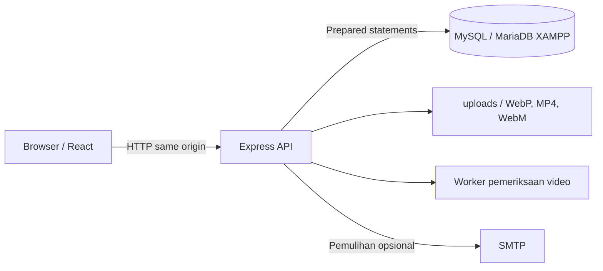
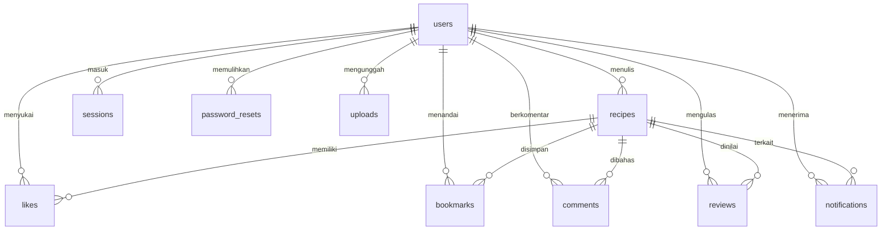

# Arsitektur Nusa Rasa

Frontend dan API memakai satu origin. Vite menjadi middleware saat pengembangan; setelah build, Express menyajikan `dist/`. Cookie sesi tidak dibaca JavaScript. Frontend mengambil token CSRF melalui `/api/session` dan menyertakannya pada perubahan data yang membutuhkan login.

## Relasi data

`ingredients` dan `steps` berisi array JSON di kolom teks. `recipes.video` menyimpan path video atau string kosong. `uploads.kind` membedakan foto dan video agar keduanya tidak saling dipakai pada field yang salah. Tanggal memakai UTC, karakter memakai `utf8mb4`, dan tabel memakai InnoDB. Kunci gabungan pada likes/bookmarks mencegah duplikasi per akun.

`npm run db:setup` menjalankan migrasi berversi dalam `server/migrations.js` dengan MySQL advisory lock. `schema_migrations` menyimpan versi yang selesai. Migrasi memeriksa setiap kolom sebelum menambahkannya agar percobaan ulang DDL yang terputus tidak menduplikasi kolom.

## Batas akses

- Pengunjung dapat mencari dan membaca resep serta komentar.
- Pengguna masuk dapat menyukai, menandai, berkomentar, mengunggah, dan mengedit profil sendiri.
- Hanya penulis resep yang bisa mengedit atau menghapusnya.
- Gambar yang dipakai pada resep/profil dan video resep harus berasal dari unggahan pengguna tersebut dengan jenis yang sesuai.
- Kata sandi di-hash dengan scrypt dan salt acak. Token sesi dan reset disimpan sebagai hash.
- Cookie memakai HttpOnly, SameSite=Lax, dan Secure pada mode produksi. API memeriksa origin serta token CSRF pada perubahan data terautentikasi.
- Foto dibatasi 5 MB dan 25 juta piksel; format diperiksa dengan decoder lalu dikonversi menjadi WebP tanpa metadata.
- Video dibatasi 50 MB, MP4 H.264 atau WebM VP8/VP9. Media disimpan sementara di `data/upload-tmp/`, lalu kontainer, codec, durasi, dimensi, dan paket pertama diperiksa dengan Mediabunny di worker terpisah (batas waktu 20 detik dan V8 heap 128 MB). Pemeriksaan ini tidak mendekode seluruh frame atau mengubah media. Berkas baru dipindah ke `uploads/` setelah lolos.
- Rate limit membatasi permintaan umum, login, dan unggahan.

Pemutar video menggunakan kontrol browser, `playsInline`, dan `preload="metadata"` tanpa autoplay. Express menyajikan byte range untuk seek. Unggahan memakai XHR agar progres dan pembatalan tersedia. Resep hanya menerima path milik pengguna; klien lama yang tidak mengirim field video saat mengedit tetap mempertahankan video sebelumnya. Melepas video dari resep tidak langsung menghapus berkas di disk.

## Transaksi

Setiap transaksi memegang satu koneksi pool sampai commit/rollback. Daftar akun dan notifikasi pembuka dibuat bersama. Like dan notifikasinya dibuat bersama. Permintaan serta pemakaian token pemulihan mengunci baris pengguna agar dua permintaan bersamaan tidak memakai token yang sama.

Ulasan memakai primary key gabungan `(recipe_id, user_id)`, rating 1–5, dan foto dari unggahan milik pengulas. Penyimpanan ulasan mengunci baris resep agar unggahan serentak dari akun yang sama tidak menggandakan notifikasi. Rating rata-rata dan jumlah ulasan dihitung dari seluruh tabel ulasan, bukan hanya 50 entri terbaru yang ditampilkan. Pemilik resep tidak dapat mengulas resep sendiri. Tabel baru dibuat secara idempoten oleh `db:setup`; komentar lama tetap terpisah.

## Pencarian dan mode memasak

`GET /api/recipes` mendukung `ingredients` (maksimal 6 istilah dipisahkan koma, masing-masing 40 karakter) dan `maxMinutes` (1–1440). Pencarian memakai substring tidak peka huruf besar/kecil sesuai collation database, mensyaratkan setiap bahan, dan meng-escape wildcard SQL. Semua nilai disisipkan melalui parameter query. Ini tidak menafsirkan sinonim, alergi, atau kecukupan seluruh bahan resep.

Mode memasak menggunakan dialog modal dengan fokus keyboard, progres langkah, dan satu timer dapur yang independen dari nomor langkah. Hitung mundur memakai deadline waktu aktual agar tidak bergantung pada jumlah tick saat tab berada di latar belakang. Timer dan progres hanya hidup selama dialog terbuka; tidak dikirim ke server. Gerakan kartu serta skeleton menghormati preferensi reduced motion.

## Endpoint utama

| Endpoint                                                               | Fungsi                                                        |
| ---------------------------------------------------------------------- | ------------------------------------------------------------- |
| `GET /api/config`, `GET /api/session`                                  | Konfigurasi publik dan sesi saat ini                          |
| `POST /api/auth/register`, `/login`, `/logout`                         | Akun dan sesi                                                 |
| `POST /api/auth/forgot`, `/reset`                                      | Pemulihan kata sandi                                          |
| `PATCH /api/profile`                                                   | Profil pengguna saat ini                                      |
| `GET /api/recipes`, `GET /api/recipes/:id`                             | Daftar dan detail resep                                       |
| `POST /api/recipes`, `PUT /api/recipes/:id`, `DELETE /api/recipes/:id` | Kelola resep                                                  |
| `PUT /api/recipes/:id/like`, `/bookmark`                               | Set status suka/penanda dengan `{active: boolean}`            |
| `GET/POST /api/recipes/:id/comments`                                   | Komentar resep                                                |
| `GET /api/recipes/:id/reviews`                                         | 50 ulasan terbaru, ulasan akun saat ini, jumlah dan rata-rata |
| `PUT/DELETE /api/recipes/:id/review`                                   | Simpan atau hapus ulasan milik akun saat ini                  |
| `GET /api/notifications`, `PATCH /api/notifications/read`              | Pemberitahuan pengguna                                        |
| `POST /api/uploads`                                                    | Foto, multipart field `image`                                 |
| `POST /api/uploads/video`                                              | Video, multipart field `video`; mengembalikan path dan durasi |

## Verifikasi

Pengujian mencakup login/logout, hash kata sandi, CSRF/origin, CRUD resep, persistensi melalui koneksi database kedua, hak kepemilikan, unggahan tidak valid, like/penanda per pengguna, komentar/notifikasi, reset token kedaluwarsa dan sekali pakai, rollback, serta permintaan bersamaan. Tes video menggunakan fixture sintetis MP4 dan WebM untuk unggah, persistensi, byte range, ganti/hapus, penolakan berkas palsu atau terlalu besar, serta migrasi skema lama tanpa kehilangan data. Tes pencarian menggabungkan bahan, durasi, daerah dan penanda, termasuk escape wildcard. Tes ulasan memeriksa rating, foto, rata-rata, pembaruan tanpa duplikasi, kepemilikan, persistensi, notifikasi serentak, dan penghapusan. Semua berjalan pada database MySQL sementara, terpisah dari database aplikasi.
