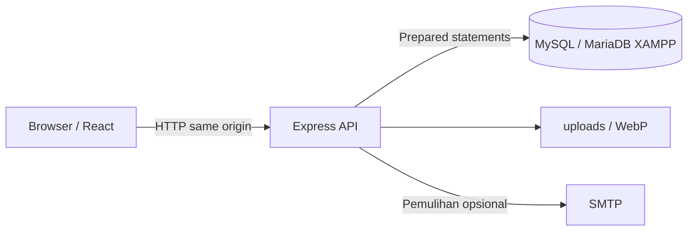
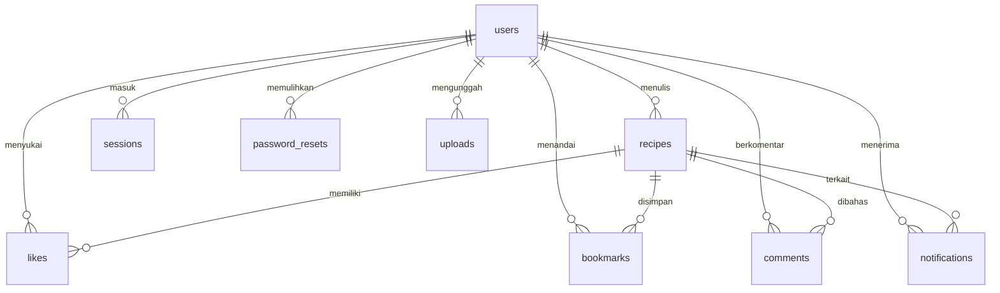

# Arsitektur Nusa Rasa

Frontend dan API memakai satu origin. Vite menjadi middleware saat pengembangan; setelah build, Express menyajikan `dist/`. Cookie sesi tidak dibaca JavaScript. Frontend mengambil token CSRF melalui `/api/session` dan menyertakannya pada perubahan data yang membutuhkan login.

## Relasi data

`ingredients` dan `steps` berisi array JSON di kolom teks. Tanggal memakai UTC, karakter memakai `utf8mb4`, dan tabel memakai InnoDB. Kunci gabungan pada likes/bookmarks mencegah duplikasi per akun.

## Batas akses

- Pengunjung dapat mencari dan membaca resep serta komentar.
- Pengguna masuk dapat menyukai, menandai, berkomentar, mengunggah, dan mengedit profil sendiri.
- Hanya penulis resep yang bisa mengedit atau menghapusnya.
- Gambar yang dipakai pada resep/profil harus berasal dari unggahan pengguna tersebut.
- Kata sandi di-hash dengan scrypt dan salt acak. Token sesi dan reset disimpan sebagai hash.
- Cookie memakai HttpOnly, SameSite=Lax, dan Secure pada mode produksi. API memeriksa origin serta token CSRF pada perubahan data terautentikasi.
- Berkas dibatasi 5 MB dan 25 juta piksel; format foto diperiksa dengan decoder lalu dikonversi menjadi WebP tanpa metadata.
- Rate limit membatasi permintaan umum, login, dan unggahan.

## Transaksi

Setiap transaksi memegang satu koneksi pool sampai commit/rollback. Daftar akun dan notifikasi pembuka dibuat bersama. Like dan notifikasinya dibuat bersama. Permintaan serta pemakaian token pemulihan mengunci baris pengguna agar dua permintaan bersamaan tidak memakai token yang sama.

## Endpoint utama

| Endpoint                                                               | Fungsi                                             |
| ---------------------------------------------------------------------- | -------------------------------------------------- |
| `GET /api/config`, `GET /api/session`                                  | Konfigurasi publik dan sesi saat ini               |
| `POST /api/auth/register`, `/login`, `/logout`                         | Akun dan sesi                                      |
| `POST /api/auth/forgot`, `/reset`                                      | Pemulihan kata sandi                               |
| `PATCH /api/profile`                                                   | Profil pengguna saat ini                           |
| `GET /api/recipes`, `GET /api/recipes/:id`                             | Daftar dan detail resep                            |
| `POST /api/recipes`, `PUT /api/recipes/:id`, `DELETE /api/recipes/:id` | Kelola resep                                       |
| `PUT /api/recipes/:id/like`, `/bookmark`                               | Set status suka/penanda dengan `{active: boolean}` |
| `GET/POST /api/recipes/:id/comments`                                   | Komentar resep                                     |
| `GET /api/notifications`, `PATCH /api/notifications/read`              | Pemberitahuan pengguna                             |
| `POST /api/uploads`                                                    | Foto, multipart field `image`                      |

## Verifikasi

Pengujian mencakup login/logout, hash kata sandi, CSRF/origin, CRUD resep, persistensi melalui koneksi database kedua, hak kepemilikan, unggahan tidak valid, like/penanda per pengguna, komentar/notifikasi, reset token kedaluwarsa dan sekali pakai, rollback, serta permintaan bersamaan. Semua berjalan pada database MySQL sementara, terpisah dari database aplikasi.
